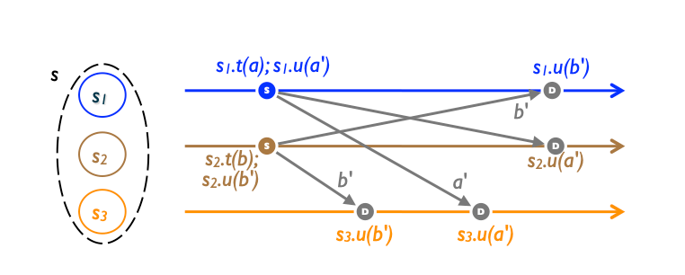

# Operation-based Commutative Replicated Data Type (CmRDT)

## Figures

## Definition

**Operation-based CRDTs (also called op-based CRDTs)** rely on the concept of operations, which are actions that change the state of the data structure. Each replica maintains a list of operations that it has performed, and these operations are propagated to other replicas. Each replica applies the operations it receives in the same order, ensuring that the state of the data structure remains consistent across all replicas.

## Deep Dive

In an op-based object, a reliable broadcast channel guarantees that all updates are delivered at every replica, in the delivery orderdspecified by the data type. Operations not ordered bydare saidconcurrent; formallyf∥dg⇔f̸dg∧g̸df. If all concurrent operationscommute, then all execution orders consistent with delivery order are equivalent, and all replicas converge to the same state. Such an object is called a Commutative Replicated Data Type (CmRDT).

As noted earlier, for all data types studied here, causal delivery (which is readily implementable in static distributed systems and does not require consensus) satisfies delivery ordered. For some data types, a weaker ordering suffices, but then more pairs of operations need to be proved commutative.

Ref: [A comprehensive study of Convergent and Commutative Replicated Data Types](https://inria.hal.science/inria-00555588/document)
