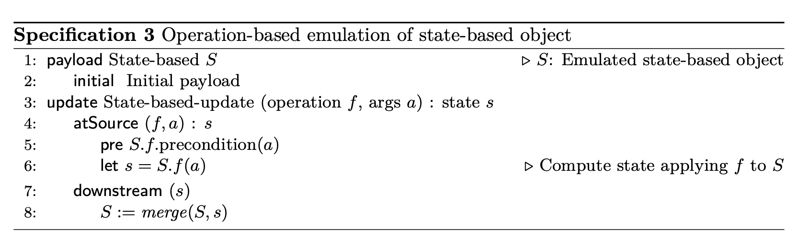
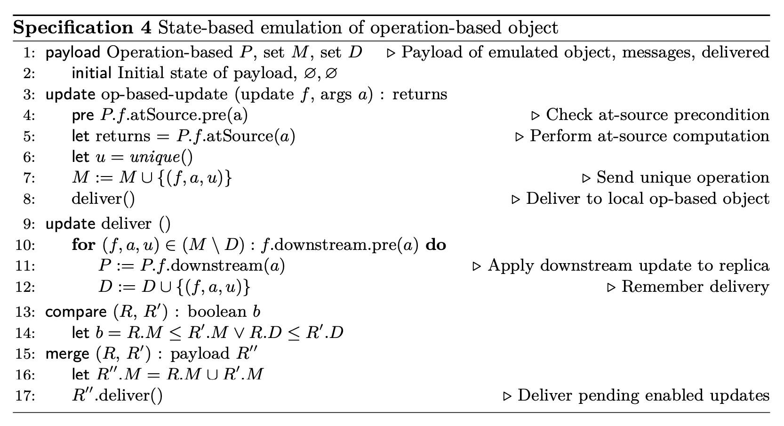

# Relation between CvRDT and CmRDT

## Differences

| Criteria                  | Operation-based CRDTs                                         | State-based CRDTs                                                     |
| ------------------------- | ------------------------------------------------------------- | --------------------------------------------------------------------- |
| Representation of updates | A sequence of operations                                      | A complete copy of the data structure's state                         |
| Propagation of updates    | Propagate individual operations                               | Propagate the entire state                                            |
| Convergence               | Same sequence of operations in the same order                 | Associative, commutative, and idempotent merge function               |
| Memory overhead           | Lower memory overhead                                         | Higher memory overhead                                                |
| Network overhead          | Higher network overhead                                       | Lower network overhead                                                |
| Applications              | Systems that require low memory overhead and fast convergence | Systems that require low network overhead and simpler merge functions |

## Operation-based emulation of a state-based object

Interestingly, it is always possible to emulate a state-based object using the operation-based approach, and vice-versa.

In specification above, we show operation-based emulation of a state-based object (taking some liberties with notation). Ignoring queries (which pose no problems), the emulating operation- based object has a single update that computes some state-based update (after checking for its precondition) and performs merge downstream. The downstream precondition is empty because merge must be enabled in any reachable state. The emulation does not make use of compare.

If the base object is a CvRDT, then merge operations commute, and the emulated object is a CmRDT.

Ref: [A comprehensive study of Convergent and Commutative Replicated Data Types](https://inria.hal.science/inria-00555588/document)

## State-based emulation of an operation-based object

State-based emulation of an operation-based object essentially formalises the mechanics of an epidemic reliable broadcast, as shown in Spec. 4 (taking some liberties with notation).

Again, we ignore queries, which pose no problems. Calling an operation-based update adds it to a set of M messages to be delivered; merge takes the union of the two message sets.

When an update’s downstream precondition is true, the corresponding message is delivered by executing the downstream part of the update. In order to avoid duplicate deliveries, delivered messages are stored in a set D.

The states of the emulating object form a monotonic semilattice. Calling or delivering an operation adds it to the relevant message set, and therefore advances the state in the partial order. merge is defined to take the union of the M sets, and is thus a LUB operation. Remark that M is identical to the causal history of the replica; non-concurrent updates appear in M in causal order. If the emulated op-based object is a CmRDT, then delivery order is satisfied. Concurrent operations appear in M in any order; if the emulated object is a CmRDT, they commute. Therefore, after two replicas merge mutually, their D sets are identical and their P payloads have equivalent state.

Ref: [A comprehensive study of Convergent and Commutative Replicated Data Types](https://inria.hal.science/inria-00555588/document)
