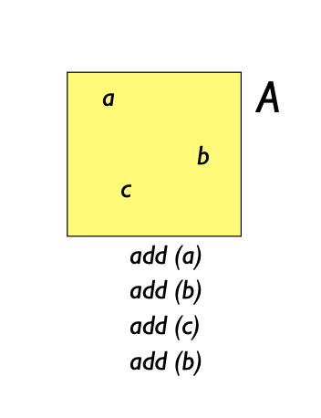
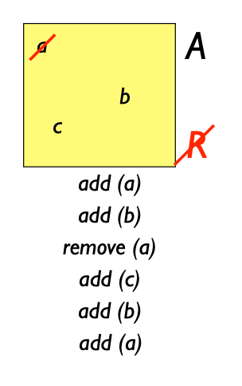
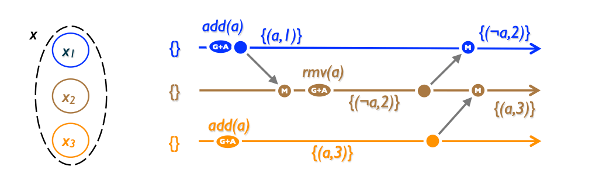
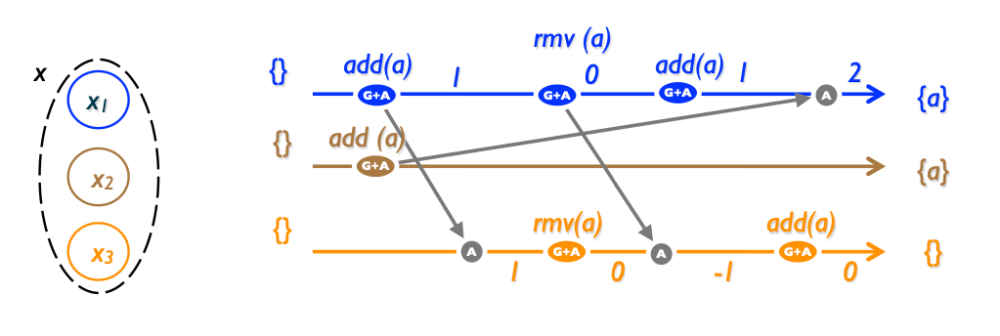
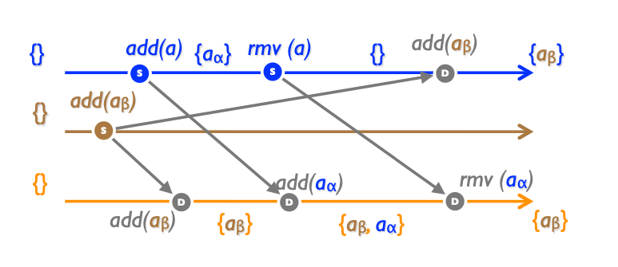

# Set CRDTs

Sets constitute one of the most basic data structures. Containers, Maps, and Graphs are all based on Sets.

Operations add and remove are applied sequentially as they arrive. Initially, the set is empty. Replica 1 adds element a, then removes a; its state is again empty. Replica 2 adds the same element a; when Replica 1 applies this operation, its (final) state becomes {a}. Replica 3 receives the two add operations; the second one has no effect since a is already in the set. Then it receives the remove, which makes its state empty. Both Replica 1 and Replica 3 have applied all operations in causal order, yet they diverge.

Ref: [A comprehensive study of Convergent and Commutative Replicated Data Types](https://inria.hal.science/inria-00555588/document)

## Grow-Only Set ( G-Set )

A very simple solution — to disallow rmv() operation at all. add() operations commute, the merge() function is just a set union.

Illustrate G-Set:



### Example code

```typescript
type GSet<T> = Set<T>;

type Endpoint<T> = CRDT.Endpoint<GSet<T>, T, null, T>;

const crdt: CRDT.Crdt<GSet<unknown>, unknown, null, unknown> = {
  Default: new Set(),
  Query: (crdt) => Array.from(crdt),
  Prepare: (_, value) => value,
  Effect: (existing, e) => new Set([...existing, e.Data]),
};

const props = <T>(db: CRDT.Database, replica: string, ctx: CRDT.ActorContext) =>
  CRDT.replicator(crdt, db, replica, ctx);

const add = async <T>(value: T, ref: Endpoint<T>): Promise<void> => {
  const command: CRDT.Command<T> = ["", value];
  await ref(command);
};

const query = async <T>(ref: Endpoint<T>): Promise<T[]> => {
  const result = await ref(CRDT.Query);
  return result;
};
```

**How code work:**
We define the GSet type, which is a set that only supports adding elements, and not removing or updating them. We then define the Endpoint type, which represents a reference to a CRDT instance.

We then define the crdt object, which represents the G-Set CRDT. It has a Default property, which specifies the initial state of the CRDT, a Query property, which specifies how to extract the value of the CRDT, a Prepare property, which specifies how to prepare a command for the CRDT, and an Effect property, which specifies how to apply a command to the CRDT.

We then define the props function, which creates a replicator function for the G-Set CRDT, and the add and query functions, which allow us to add elements to the CRDT and query its current state, respectively.

### Sample scenario

A practical example of using a G-Set CRDT could be in a collaborative shopping list application. Suppose there are multiple users who are collaborating on a single shopping list. Each user can add items to the list, and any user can mark an item as "purchased" when they buy it.

To implement this functionality using a G-Set CRDT, we could create a G-Set for the shopping list. Each item in the shopping list would be a unique identifier, such as a UUID. Whenever a user adds an item to the list, they would insert the item's identifier into the G-Set. Whenever a user marks an item as "purchased", they would send a message to all other users indicating that the item has been purchased. Each user would then remove the item's identifier from their local G-Set.

## Two Phase Set ( 2P-Set )

Allows rmv() operation but you can't re-add an element after its deletion. An additional G-set can be used to track removed elements (also called tombstone set).

Illustrate 2P-Set:



### Example code

```typescript
type TwoPSet<T> = {
  additions: Set<T>;
  removals: Set<T>;
};

type Operation<T> = {
  type: "add" | "remove";
  value: T;
};

type Endpoint<T> = CRDT.Endpoint<TwoPSet<T>, T[], T[], Operation<T>>;

const crdt: CRDT.Crdt<
  TwoPSet<unknown>,
  unknown[],
  unknown[],
  Operation<unknown>
> = {
  Default: {
    additions: new Set(),
    removals: new Set(),
  },
  Query: (crdt) => Array.from(crdt.additions),
  Prepare: (_, value) => value,
  Effect: (existing, e) => {
    const { type, value } = e;
    if (type === "add") {
      return {
        additions: new Set([...existing.additions, value]),
        removals: new Set(existing.removals),
      };
    } else if (type === "remove") {
      if (existing.additions.has(value)) {
        return {
          additions: new Set(existing.additions),
          removals: new Set([...existing.removals, value]),
        };
      } else {
        return existing;
      }
    } else {
      return existing;
    }
  },
};

const props = <T>(db: CRDT.Database, replica: string, ctx: CRDT.ActorContext) =>
  CRDT.replicator(crdt, db, replica, ctx);

const add = async <T>(value: T, ref: Endpoint<T>): Promise<void> => {
  const command: CRDT.Command<Operation<T>> = { type: "add", value };
  await ref(command);
};

const remove = async <T>(value: T, ref: Endpoint<T>): Promise<void> => {
  const command: CRDT.Command<Operation<T>> = { type: "remove", value };
  await ref(command);
};

const query = async <T>(ref: Endpoint<T>): Promise<T[]> => {
  const result = await ref(CRDT.Query);
  return result;
};
```

In this implementation, the `TwoPSet` type represents a 2P-Set CRDT, which contains two sets: `additions` and `removals`. The `Operation` type defines two possible operations: "add" and "remove". The `Endpoint` type is defined similarly to the previous examples, with the addition of the `Operation` type.

The `crdt` object is the actual CRDT, with the `Default`, `Query`, `Prepare`, and `Effect` properties defined as before.

The `props` function returns a replicator function for a 2P-Set CRDT.

The `add` and `remove` functions take a value and an endpoint, and add or remove the value from the set, respectively.

The `query` function takes an endpoint and returns the current set of values as an array.

### Sample scenario

A 2P-Set can be useful in a collaborative document editing scenario where multiple users can add or remove items from a list.

Let's say we have a to-do list that multiple users can access and modify concurrently. We want to ensure that each user has their own independent copy of the list, but also that they can merge their changes with the changes made by other users.

We can use a 2P-Set to achieve this. Each user would have their own 2P-Set for the to-do list. The "add" operation would add an item to the "added" set, while the "remove" operation would add the item to the "removed" set. When merging the sets from multiple users, we simply union their added and removed sets to get the final list.

## Last Write Wins Element Set ( LWW-Element-Set )

Idea is to introduce a total order on a set. For example, generating timestamps. We need to have two sets: add-set and remove-set.

add() adds (element, unique_id()) to the add-set, rmv() adds to the remove-set. lookup() checks where the id is greater — in add-set or rmv-set.



### Example code

```typescript
type Element<T> = { value: T; timestamp: Date };

class LWWSet<T> {
  private addSet: Set<Element<T>> = new Set();
  private removeSet: Set<Element<T>> = new Set();

  add(value: T, timestamp: Date = new Date()): void {
    this.addSet.add({ value, timestamp });
  }

  remove(value: T, timestamp: Date = new Date()): void {
    this.removeSet.add({ value, timestamp });
  }

  has(value: T): boolean {
    for (const element of this.addSet) {
      if (
        element.value === value &&
        !this.isRemoved(value, element.timestamp)
      ) {
        return true;
      }
    }
    return false;
  }

  merge(other: LWWSet<T>): void {
    for (const element of other.addSet) {
      if (!this.isRemoved(element.value, element.timestamp)) {
        this.addSet.add(element);
      }
    }

    for (const element of other.removeSet) {
      if (this.isAdded(element.value, element.timestamp)) {
        this.removeSet.add(element);
      }
    }
  }

  private isRemoved(value: T, timestamp: Date): boolean {
    for (const element of this.removeSet) {
      if (element.value === value && element.timestamp >= timestamp) {
        return true;
      }
    }
    return false;
  }

  private isAdded(value: T, timestamp: Date): boolean {
    for (const element of this.addSet) {
      if (element.value === value && element.timestamp >= timestamp) {
        return true;
      }
    }
    return false;
  }
}
```

In this implementation, the `LWWSet` class keeps track of two sets: `addSet` and `removeSet`. The `add` method adds an element to the `addSet` with a timestamp. The `remove` method adds an element to the `removeSet` with a timestamp.

The `has` method checks if an element exists in the `addSet` and has not been removed from the `removeSet` with a later timestamp.

The `merge` method takes another `LWWSet` as an argument and merges its `addSet` and `removeSet` with its own, using the timestamps to resolve conflicts.

Overall, this implementation follows the basic idea of LWW-Set by keeping track of both additions and removals with timestamps and resolving conflicts using the timestamps.

### Sample scenario

LWW-Set can be useful in any application where there is a need to track the most recent updates to a set of items. One practical example is a collaborative document editor where multiple users can edit a document simultaneously. In this scenario, LWW-Set can be used to track the changes made to the document by different users and ensure that the most recent changes are reflected in the final document.

For example, let's say we have a document editor where multiple users can add or remove words from a document. We can represent the document as an LWW-Set where each element is a word and its timestamp indicates when it was last updated. Whenever a user makes a change to the document, we update the corresponding element in the LWW-Set with the current timestamp.

When multiple users make changes to the same word, the one with the most recent timestamp will be considered the most recent update. We can use this information to resolve conflicts and ensure that the final document reflects the most recent changes made by all users.

LWW-Set can also be useful in distributed systems where multiple nodes need to track changes to a set of items. For example, in a distributed cache where multiple nodes can update the cache simultaneously, LWW-Set can be used to track the most recent updates and ensure that all nodes have consistent data.

## Positive Negative Set ( PN-Set )

One more way with ordering a set — add a counter per each element. Increase it on add() operation, decrease on rmv(). Element to be considered in the set if and only if his counter is positive.

Notice an interesting side-effect: the element didn't appear after it has been added in the 3rd replica



Initially, our PN-Set is empty. Replica 1 performs `add(e)`, element `e` has a count of 1.

The operation propagates to Replica 3. Now Replicas 1 and 3 both concurrently execute `remove(e)`, after Replica 3 applies both operations, `e` has a count of `-1`.

A subsequent `add(e)` has no effect: thus, after adding an element to an empty "set" it remains empty!

For some applications, this may be the intended semantics. for instance, in an inventory, a negative count may account for goods in transit. In others, this may be considered a bug.

Although the semantics are strange, PN-Set converges; thus if Replica 2 concurrent executes `add(e)` all replicas converge to state `{e}`.

### Example code

```typescript
class PNSet<T> {
  private positives = new Map<T, number>();
  private negatives = new Map<T, number>();

  add(elem: T) {
    const curCounter = this.positives.get(elem) ?? 0;
    this.positives.set(elem, curCounter + 1);
  }

  remove(elem: T) {
    const posCounter = this.positives.get(elem) ?? 0;
    const negCounter = this.negatives.get(elem) ?? 0;
    if (posCounter > negCounter) {
      this.negatives.set(elem, negCounter + 1);
    } else {
      this.positives.delete(elem);
    }
  }

  has(elem: T): boolean {
    const posCounter = this.positives.get(elem) ?? 0;
    const negCounter = this.negatives.get(elem) ?? 0;
    return posCounter > negCounter;
  }

  values(): T[] {
    const result: T[] = [];
    for (const [elem, posCounter] of this.positives) {
      const negCounter = this.negatives.get(elem) ?? 0;
      if (posCounter > negCounter) {
        result.push(elem);
      }
    }
    return result;
  }
}
```

## Observed-Remove Set ( OR-Set, Add-Win Set )

add() has priority over rmv() In this data type. An example of possible implementation could be: add a unique tag (per element) to each newly added element. Then rmv() sends all seen tags of the element to other replicas. Replicas keep other tags.



The payload consists of a set of pairs `(element, unique-identifier)`. A `lookup(e)` extracts element `e` from the pairs. Operation `add(e)` generates a unique identifier in the source replica, which is then propagated to downstream replicas, which insert the pair into their payload. Two `add(e)` generate two unique pairs, but `lookup` masks the duplicates.

When a client calls `remove(e)` at some source, the set of unique tags associated with `e` at the source is recorded. Downstream, all such pairs are removed from the local payload. Thus, when `remove(e)` happens-after any number of `add(e)`, all duplicate pairs are removed, and the element is not in the set any more, as expected intuitively. When `add(e)` is concurrent with `remove(e)`, the `add` takes precedence, as the unique tag generated by `add` cannot be observed by `remove`.

## Remove-win Set
Same as above but rmv() has priority over add()