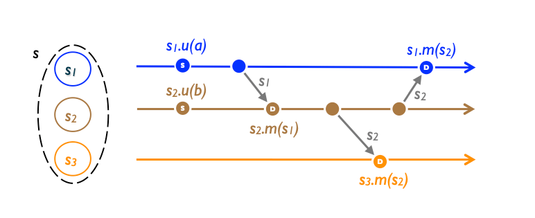

# State-based Convergent Replicated Data Type (CvRDT)

## Figures

## Definition
**State-based CRDTs (also called state-based replicated data types or state-based CRDTs)** do not rely on operations. Instead, each replica maintains a copy of the entire data structure, and updates are propagated to other replicas by exchanging the entire state of the data structure. The state of the data structure on each replica is merged using a merge function, which takes the states from two replicas and combines them into a new state that represents the merged state of the two replicas.

## Deep Dive
In state-based (or passive) replication, an update occurs entirely at the source, then propagates by transmitting the modified payload between replicas, as illustrated above.

We specify state-based object types as shown in Specification 1. Keyword *payload* indicates the payload type, and initial specifies its initial value at every replica. Keyword update indicates an update operation, and query a query. Both may have (optional) arguments and return values. Non-mutating statements are marked let, and payload is mutated by assignment :=. An operation executes atomically.

To capture safety, an operation is enabled only if a given source pre-condition (marked pre in a specification) holds in the source's current state. The source pre-condition is omitted if always enabled, e.g., incrementing or decrementing a Counter. Conversely, non-null pre- conditions may be necessary, for instance an element can be removed from a Set only if it is in the Set at the source.

The system transmits state between arbitrary pairs of replicas, in order to propagate changes. This updates the payload of the receiver with the output of operation merge, invoked with two arguments, the local payload state and the received state. Operation compare compares replica states, as will be explained shortly.

Ref: [A comprehensive study of Convergent and Commutative Replicated Data Types](https://inria.hal.science/inria-00555588/document)