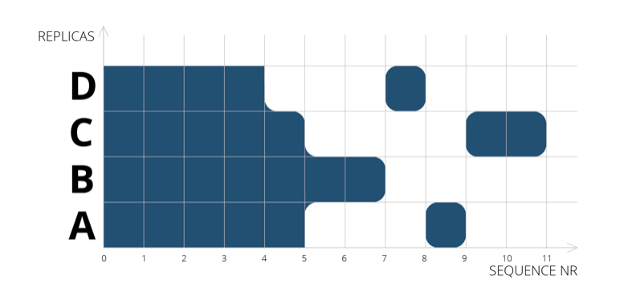

# Yjs Framework

Yjs is a CRDT implementation that exposes its internal data structure as shared types. Shared types are common data types like Map or Array with superpowers: changes are automatically distributed to other peers and merged without merge conflicts.

Yjs is network agnostic (p2p!), supports many existing rich text editors, offline editing, version snapshots, undo/redo and shared cursors. It scales well with an unlimited number of users and is well suited for even large documents.

[Yjs - Github](https://github.com/yjs/yjs)

:::info

Below information is based on what I have learned and it is referenced to this blog: [Delta-state CRDTs: indexed sequences with YATA](https://www.bartoszsypytkowski.com/yata/)

For more information, please read this paper: [YATA paper](https://www.researchgate.net/publication/310212186_Near_Real-Time_Peer-to-Peer_Shared_Editing_on_Extensible_Data_Types)

:::

:::warning

**Disclaimer:**

I just note these infos that I found and learned, I dont own anything beside some images that I drawn

These code is generated by ChatGPT from F# to Typescript based on code in above blog, I haven't checked its exactness

:::

## Dots

We'll use a separate sequencer for every replica and use pair of (replica-id, sequence-nr) (also known as dot) to represent a timestamp of a particular operation made on that replica

1.  It allows us to uniquely identify every single operation made on any replica.

2.  It allows us to track causal relations between events - so while we may not be able to set a total order of events (fortunately we don't need it), we still know how to order operations made by a single replica.

3.  Unlike standard time, for every operation we increase sequence number by one. This way we can keep track of "holes" - a discontinuous events we haven't yet observed for some reason.

We're used to represent observed events using markers on some sort of a timeline, like this:


With **dots** we can represent them using 2-dimensional space instead

Each filled cell represents a discrete event we observed, described as a dot. As you can see, most of the events form a continuous surface, only few ones are detached. This reflects a real life situation, since as we replicate our updates among replicas, each replica will try to keep up with incoming changes, filling the gaps it was not aware of before, thus over time filling the space from left to right



Ref: [CRDT optimization](https://www.bartoszsypytkowski.com/optimizing-state-based-crdts-part-2/)

## Interleaving

In short interleaving may happen, when two peers decide to insert entire ranges of elements at the same index. After synchronizing with each other it may turn out that their inserts are mixed (interleaved with each other). While this may not be an issue in some cases, there's a one famous scenario where this behavior wrecks havoc: collaborative text editing.

For example:

_Two people, Alice and Bob, want to collaborate over a text document. Initial document content was "hi !". While offline, Alice edited it to "hi mom!", while Bob to "hi dad!". Once they got online, their changes were synchronized. What's a desired state of the document after sync?_


While we could accept resolved document in form of "hi momdad!" or "hi dadmom!" - since they are easy to fix - the fact that characters from individual users could be mixed together would result in subpar user experience.

## YATA algorithm (Yet Another Transformation Approach)

### Meta data

Our core unit of composition is `Block` type. We can simply represent a Yata collection in terms of array, where blocks are laid out in their read order


- `id`: unique block identifier
- `originLeft`: left neighbor at moment of original insertion
- `originRight`: right neighbor at moment of original insertion
- `value`: value stored in a block, None if tombstoned
- `isDeleted`; delete flag, true if tombstoned

### Insertion

With Insert operation, first we need to map user defined index in to actual index inside our YATA collection


Then we obtain IDs of its neighbors (if they exist)


Finally we're creating a new block and inserting it at mapped index

### Deletion

With deletion, all we need to do is to map user index with regard to tombstones to find a correct block and remove its value


### Merging

In order to safely resolve any potential conflicts, that may have appeared in result of concurrent block insertion, we use left and right origins as a reference points. That mean, they must have been there first.

When we're going to do merges we also need to remember about existing blocks that have been tombstoned - we only recognize them by absence of their value. Thankfully, once a block is deleted, it's not reintroduced again: inserting the same value at the same index is still a separate insert operation.


1.  The tombstones variable is created to store the IDs of any blocks in b that have been tombstoned.

2.  The a array is cloned and any blocks with IDs that match those in tombstones have their value set to undefined (i.e., they are tombstoned).

3.  The IDs of blocks in a are stored in the seen set.

4.  The blocks variable is created to store any blocks in b that do not already exist in a.


5.  For each block in blocks, it is checked to see if its dependencies (i.e., the blocks it references with its OriginLeft and OriginRight properties) already exist in a. If they do not, the block is skipped for now and the loop continues.

6.  Extract the ID and sequence number of the block to be inserted.

7.  Determine the last sequence number of the block's ID in the array.

8.  Check if the block's sequence number is exactly one greater than the last sequence number for its ID. If not, that means there is a gap in the sequence of blocks with that ID, which is not allowed

9.  Find the index at which to insert the new block in the array.

10. The loop continues until all blocks in blocks have been inserted into a. The updated a array is returned

Based on the left and right origins of the block, we can establish a boundaries between which it's safe to insert a new block eg. if originally block was inserted at index 1, it's left and right origins prior to insertion were are positions 0 (left) and 1 (right)

However as blocks can be inserted in the same place at different times on different replicas, the window between left and right origins may have grown. To resolve total order of blocks inserted within that window, we're use following function

**Find Insert Index**

We're going to compare the unique identifiers of each peer so that inserts made by peers with higher IDs will always be placed after peers with lower IDs.


This is in essence very similar to RGA conflict resolution algorithm (_in case of concurrent inserts at the same position shift element to the right if its contender had lower peer id_) with one difference:

- RGA block ID uses a single globally incremented counter. A right shift stop condition is: *until sequence number of a right-side neighbor's ID is lower than current block's*. This has sense, as globaly incremented sequence number means that only concurrently inserted blocks can have same or higher sequence numer.
- YATA block ID uses a counter per replica, however here a right shift stop condition is defined explicitly - it's a position of our right origin.

As you might have noticed this implementation doesn't allow for out-of-order deliveries - which puts some restrictions on our replication protocol. Some implementations (like Yjs) solve this by stashing blocks that have arrived before their predecessors and reintegrating them once block's dependencies have been received.

### Deltas

This approach is not flexible and can introduce heavy overhead - changing one element would require sending entire state to all peers

We need to implement deltas approach so that they only carry information not observed by specific peers

Fortunately there's a 1-1 relation between YATA block IDs and vector clocks. Here all we really need is to aggregate the highest IDs of all blocks in current YATA array:

```typescript
function version(a: Yata<T>): VTime {
  return a.reduce((vtime, block) => {
    const [replicaId, seqNr] = block.id;
    const seqNrPrev = vtime.get(replicaId);
    if (seqNrPrev === undefined) {
      vtime.set(replicaId, seqNr);
    } else {
      vtime.set(replicaId, Math.max(seqNrPrev, seqNr));
    }
    return vtime;
  }, Version.zero);
}
```

All we need to do is to take blocks which sequence numbers are higher that sequence numbers of corresponding vector clock entries. After this we're almost done: we also need to remember that there might be blocks known to remote peer, that have been deleted in the meantime. For this reason we take IDs of tombstoned blocks and pass them over as well.

```typescript
type Delta<T> = [Yata<T>, string[]];

function delta<T>(version: VTime, a: Yata<T>): Delta<T> {
  const deltaArray = a.filter((block) => {
    const [replicaId, seqNr] = block.Id;
    const seqNrPrev = version.get(replicaId);
    return seqNrPrev === undefined || seqNr > seqNrPrev;
  });

  const tombstones = a
    .filter((block) => block.IsDeleted)
    .map((block) => block.Id);

  return [deltaArray, tombstones];
}
```

While it may look like pushing all tombstoned elements is not really matching what we'd like to expect from delta behavior, in practice they are minor issue:

1.  Since we only pass identifiers, their size is pretty small.

2.  Practical implementations may encode tombstoned ranges in very compact notation eg. `A:(1..100)` to encode **all** deleted blocks from `A:1` up to `A:100`.

After describing these details, implementation of delta merges becomes trivial:

```typescript
function mergeDelta<T>(delta: [Yata<T>, ID[]], a: Yata<T>): Yata<T> {
  const [deltaArray, tombstones] = delta;
  const merged = merge(a, deltaArray); // merge newly inserted blocks
  return merged.map((block) =>
    !block.IsDeleted && tombstones.includes(block.Id)
      ? { ...block, Value: undefined } // tombstone block
      : block
  );
}
```

## Architecture

:::info

Reference blog: [Deep dive into Yrs architecture](https://www.bartoszsypytkowski.com/yrs-architecture/)

Because the shared foundation and optimization techniques of both of these projects are the same so I will use it as reference to note!

:::

### Document

Document is the most top-level organization unit in Yjs. It basically represents an independent key-value store, where keys are names defined by programmers, and values are so called root types: a Conflict-free Replicated Data Types (CRDTs) that serve particular purposes.

In Yjs every operation happens in a scope of its document: all information is stored in documents, all causality (represented by the vector clocks) is tracked on per document basis. If you want to compute or apply a delta update to synchronize two peers, this also must happen on an entire document.

Documents are using delta-state variant of CRDTs and offer a very simple 2-step protocol:

1.  Document _A_ sends its vector version to Document _B_.

2.  Based on _A_'s state vector, _B_ can calculate missing delta which contains only the necessary data and then send it back to _A_.

### Block (struct)


Each block is reinforced by a set of fields, most of which are optional:

- Unique block identifier, which is logically similar to [Lamport Timestamp](https://en.wikipedia.org/wiki/Lamport_timestamp).

- Left and right origins which point to its neighbours IDs at the moment of insertion and are used by YATA algorithm.

- Pointers to left and right blocks - in Yjs/Yrs block sequences are organized as double-linked lists. Keep in mind that, these fields don't have to be equal to origins: origins represent neighbors at the moment of original block insertion, while these pointers represent current placement of a block in relation to others.

- Parent, which points to a shared type containing this block. In case you haven't figured out: Yjs/Yrs collection types can be nested in each other, creating a recursively nested document trees.

- In cases of map-like types (YMap but also attributes of XML types), it can also contain an associated key, it's responsible for, effectively working as a key-value entry.

- Bit-flag field informing about various properties specific to that block data, such as information if such block has been tombstoned or what is its intended collection type.

- Content, which contains a user-defined data. It can be as simple as a JSON-like value - number, string, boolean or embedded map that doesn't expose CRDT properties, but also other nested CRDT collections.

These blocks are organized in a block store on per client (peer) basis - all blocks produced by the same client are laid out next to each other in memory:


:::note

This is a lot of metadata to hold for every single character inserted by the user. That would be right, however Yjs implements an optimization technique that allows us to squash blocks inserted or deleted one after another, effectively reducing their count while keeping all guarantees in check

:::

#### Block splitting

All of this is possible because consecutive block ID (client_id-clock pairs) are not assigned using clock numbers increased by one per block, but by one per a block element

_For example: if we assigned an ID A:1 to a 3-element block [a,b,c] and then insert a next element d on the same client, that inserted block's ID will be A:4 (it's increased by the number of elements stored in the previous block)_


#### Block squashing

It's very useful in scenarios when the same peer inserts multiple elements one after another as a separate operations. The most obvious case of this is simply writing sentences character by character in your text editor.

Thanks to block squashing, we can represent separate consecutive blocks of data

_For example: A:1=[a] followed by A:2=[b] using a single block instead (A:1=[a,b])_


**Advantages:**

Reduction of memory footprint (blocks contain extra metadata that can easily outweigh a small content footprint) and better memory locality (blocks are organized as double linked list nodes, while contents of individual block form continuous array of elements placed next to each other in memory).

**Limitations:**

Squashed blocks must contain data of the same slittable type and next to each other both in terms of:

1.  being each others neighbours

2.  emitted by the same client

3.  their IDs must follow one another with no "holes between"

_For example: we can potentially squash A:1=[a,b] with A:3=[c], but not with A:4=[c] because we would miss some block with ID A:3 in between_

### Branch

Underneath all CRDT collections are represented by the same kind of block content known as a Branch. Branch node is capable of storing two specific types of collections at once: both key-value entries and index-ordered double-linked list containing batches of items.


Represent collections capable of having CRDT semantics

Currently there are several types of these:

- Text and XmlText specializing in supporting collaborative text editing.

- Array used as index-ordered sequence of elements.

- Map used as key-value hash map with last-write-wins semantics.

- XmlElement which works as an XML node capable of having key-value string attributes as well as other nodes in user-specified order: either other XmlElements or XmlText.

**YMap Struct example:**


**XmlType Struct example:**


