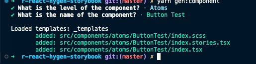

# CRA React with Hygen and Storybook

This is a template for a React project with Hygen and Storybook follow Atomic Design.

:::info

Refer to the [Hygen](https://www.hygen.io/) and [Storybook](https://storybook.js.org/) documentation for more information.

At the time this doc was written, the following versions were used:

- Yarn: @4.0.2
- Node: @18.18.2
- Storybook: @7.6.3
- Hygen: @6.2.11

:::

## Create React App

We start by creating a new React project with TypeScript.

```bash
npx create-react-app *<project-name>* --template typescript
```

## Storybook

Next we add Storybook to our project.

```bash
yarn dlx storybook@latest init
```

After we run the command above, we will be asked if we want to install the dependencies. We can answer `Y` to this question.


Then we can run Storybook.

```bash
yarn storybook
```

If we want to setting up styling with Storybook, we can follow the [Storybook docs](https://storybook.js.org/docs/configure/styling-and-css).

In this case I'm using SCSS ([refer to the docs](https://storybook.js.org/recipes/sass/)). Because I'm using CRA so I don't need to install any dependencies.

## Hygen

### Install Hygen

Next, we can now add Hygen and others dependencies to our project.

```bash
yarn add hygen
```

### Add Hygen templates

We can now add the Hygen templates to our project.

First we create a `templates` folder in the root of our project.

```bash
mkdir _templates
```

Then we can add the templates to the folder we just created.

Because I'm following Atomic Design, I create the templates for each component in the `components` folder.

```bash
mkdir _templates/components
mkdir _templates/components/new
```

Then we can add the templates to the folder we just created.

```bash
touch _templates/components/new/index.tsx.ejs.t
```

:::info

For more information on Hygen template, please refer to my [Hygen templates notes](/docs/hygen/templates).

:::

:::warning

Be careful when you copy the code below. If there is a breakline at the start of the file (before frontmatter), it will not work.

:::

In this file we can add the following code.

```js title="_templates/components/new/index.tsx.ejs.t"
---
to: src/components/<%= h.changeCase.lower(level) %>/<%= h.changeCase.pascal(name) %>/index.tsx
---
import React from 'react'

export type <%= h.changeCase.pascal(name) %>Props = {
  children: React.ReactNode
}

export const <%= h.changeCase.pascal(name) %>: React.FC<<%= h.changeCase.pascal(name) %>Props> = ({
  children
}) => (
    <div className="<%= h.changeCase.lower(level).charAt(0) %>-<%= h.changeCase.camel(name) %>">
        {children}
    </div>
)

```

Here we are creating a React component with the `name` we pass in.

The `level` is the folder level we want to create the component in. For example, if we pass in **atoms** as the level, the component will be created in the **atoms** folder.

Then we create similar scss, storybook and test files:

SCSS:

```js title="_templates/components/new/index.scss.ejs.t"
---
to: src/components/<%= h.changeCase.lower(level) %>/<%= h.changeCase.pascal(name) %>/index.scss
---
.<%= h.changeCase.lower(level).charAt(0) %>-<%= h.changeCase.camel(name) %> {
    // styles
}
```

Storybook:

```js title="_templates/components/new/index.stories.tsx.ejs.t"
---
to: src/components/<%= h.changeCase.lower(level) %>/<%= h.changeCase.pascal(name) %>/index.stories.tsx
---

import type { Meta, StoryObj } from '@storybook/react';

import { <%= h.changeCase.pascal(name) %> } from '.';

// More on how to set up stories at: https://storybook.js.org/docs/writing-stories#default-export
const meta = {
  title: '<%= h.changeCase.pascal(level) %>/<%= h.changeCase.pascal(name) %>',
  component: <%= h.changeCase.pascal(name) %>,
  parameters: {
    // Optional parameter to center the component in the Canvas. More info: https://storybook.js.org/docs/configure/story-layout
    layout: 'centered',
  },
  // This component will have an automatically generated Autodocs entry: https://storybook.js.org/docs/writing-docs/autodocs
  tags: ['autodocs'],
  // More on argTypes: https://storybook.js.org/docs/api/argtypes
  argTypes: {
  },
} satisfies Meta<typeof <%= h.changeCase.pascal(name) %>>;

export default meta;
type Story = StoryObj<typeof meta>;

// More on writing stories with args: https://storybook.js.org/docs/writing-stories/args
export const Default: Story = {
  args: {
  },
};

```

### Add Hygen generators

Next we can add the prompts for our templates.

```bash
touch _templates/components/new/prompt.js
```

In this file we can add the following code.

```js title="_templates/components/new/prompt.js"
module.exports = [
  {
    type: "select",
    name: "level",
    message: "What is the level of the component?",
    choices: [
      { title: "Atoms", value: "atoms" },
      { title: "Molecules", value: "molecules" },
      { title: "Organisms", value: "organisms" },
      { title: "Templates", value: "templates" },
    ],
  },
  {
    type: "input",
    name: "name",
    message: "What is the name of the component?",
  },
];
```

### Add Hygen configure

Next we can add the Hygen script to our `package.json` to run the generators.

```json title="package.json"

"scripts": {
  //  ...
  "gen:component": "hygen components new"
},
```

## Run

Now we can run the Hygen script to create a new component.

```bash
yarn gen:component
```

We will be asked to select the level of the component and the name of the component.




Then we can see the component is created in the `src/components` folder.
