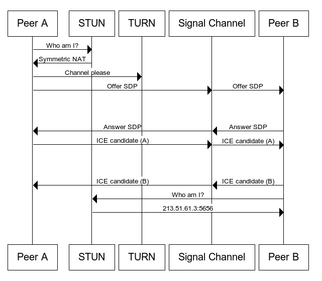

import Highlight from "@site/src/components/Highlight";

# WebRTC Connectivity

Describes how the various WebRTC-related protocols interact with one another in order to create a connection and transfer data and/or media among peers.

:::info

Resource: [WebRTC connectivity - MDN](https://developer.mozilla.org/en-US/docs/Web/API/WebRTC_API/Connectivity)

:::

## Signalling

WebRTC can't create connections without some sort of server in the middle. We call this the **signal channel** or **signaling service**

The information we need to exchange is the <Highlight color="#f87030">Offer</Highlight> and <Highlight color="#30c4f8">Answer</Highlight> which just contains the [**SDP**](/docs/webrtc/webrtc-protocols#sdp---session-description-protocol)

:::note

<Highlight color="#f87030">Offer</Highlight>: A special description is created
by caller. This description includes all the information about the caller's
proposed configuration for the call.{" "}

:::

:::note

<Highlight color="#30c4f8">Answer</Highlight>: A description of their end of the
call.

:::

**For example:**

1. _Peer A_ who will be the initiator of the connection, will create an <Highlight color="#f87030">Offer</Highlight>.

2. They will then send this offer to _Peer B_ using the chosen **signal channel**.

3. _Peer B_ will receive the <Highlight color="#f87030">Offer</Highlight> from the **signal channel** and create an <Highlight color="#30c4f8">Answer</Highlight>.

4. They will then send this back to _Peer A_ along the **signal channel**.

### Session descriptions

The configuration of an endpoint on a WebRTC connection is called a **session description**.

The description includes information about the kind of media being sent, its format, the transfer protocol being used, the endpoint's IP address and port, and other information needed to describe a media transfer endpoint. This information is exchanged and stored using [**SDP**](/docs/webrtc/webrtc-protocols#sdp---session-description-protocol)

When a user starts a WebRTC call to another user, the caller create an <Highlight color="#f87030">Offer</Highlight>. The recipient then responds with an <Highlight color="#30c4f8">Answer</Highlight>. In this way, both devices share with one another the information needed in order to exchange media data.

This exchange is handled using [**ICE**](/docs/webrtc/protocols#ice---interactive-connectivity-establishment), a protocol which lets two devices use an intermediary to exchange offers and answers even if the two devices are separated by [**NAT**](/docs/webrtc/protocols#nat---network-address-translation).

Each peer, then, keeps two descriptions on hand: **the local description**, describing itself, and **the remote description**, describing the other end of the call.

These are the basic steps which must occur to exchange the <Highlight color="#f87030">Offer</Highlight> and <Highlight color="#30c4f8">Answer</Highlight>, leaving out the [**ICE**](/docs/webrtc/protocols#ice---interactive-connectivity-establishment) layer:

1.  The caller captures local Media via [`MediaDevices.getUserMedia`](https://developer.mozilla.org/en-US/docs/Web/API/MediaDevices/getUserMedia)

2.  The caller creates `RTCPeerConnection` and calls [`RTCPeerConnection.addTrack()`](https://developer.mozilla.org/en-US/docs/Web/API/RTCPeerConnection/addTrack) (Since `addStream`is deprecating)

3.  The caller calls [`RTCPeerConnection.createOffer()`](https://developer.mozilla.org/en-US/docs/Web/API/RTCPeerConnection/createOffer) to create an <Highlight color="#f87030">Offer</Highlight>.

4.  The caller calls [`RTCPeerConnection.setLocalDescription()`](https://developer.mozilla.org/en-US/docs/Web/API/RTCPeerConnection/setLocalDescription) to set that <Highlight color="#f87030">Offer</Highlight> as the _local description_(that is, the description of the local end of the connection).

5.  After setLocalDescription(), the caller asks [**STUN**](/docs/webrtc/protocols#stun---session-traversal-utilities-for-nat) servers to generate the [**ICE**](/docs/webrtc/protocols#ice---interactive-connectivity-establishment) candidates

6.  The caller uses the signaling server to transmit the <Highlight color="#f87030">Offer</Highlight> to the intended receiver of the call.

7.  The recipient receives the <Highlight color="#f87030">Offer</Highlight> and calls [`RTCPeerConnection.setRemoteDescription()`](https://developer.mozilla.org/en-US/docs/Web/API/RTCPeerConnection/setRemoteDescription) to record it as the _remote description_ (the description of the other end of the connection).

8.  The recipient does any setup it needs to do for its end of the call: capture its local media, and attach each media tracks into the peer connection via [`RTCPeerConnection.addTrack()`](https://developer.mozilla.org/en-US/docs/Web/API/RTCPeerConnection/addTrack)

9.  The recipient then creates an <Highlight color="#30c4f8">Answer</Highlight> by calling [`RTCPeerConnection.createAnswer()`](https://developer.mozilla.org/en-US/docs/Web/API/RTCPeerConnection/createAnswer).

10. The recipient calls [`RTCPeerConnection.setLocalDescription()`](https://developer.mozilla.org/en-US/docs/Web/API/RTCPeerConnection/setLocalDescription), passing in the created answer, to set the answer as its local description. The recipient now knows the configuration of both ends of the connection.

11. The recipient uses the signaling server to send the <Highlight color="#30c4f8">Answer</Highlight> to the caller.

12. The caller receives the <Highlight color="#30c4f8">Answer</Highlight>.

13. The caller calls [`RTCPeerConnection.setRemoteDescription()`](https://developer.mozilla.org/en-US/docs/Web/API/RTCPeerConnection/setRemoteDescription) to set the answer as the remote description for its end of the call. It now knows the configuration of both peers. Media begins to flow as configured.

### Pending and current descriptions

Because during renegotiation, an offer might be rejected because it proposes an incompatible format, it's necessary that each endpoint have the ability to propose a new format but not actually switch to it until it's accepted by the other peer. For that reason, WebRTC uses **pending and current descriptions**.

- The **`current description`** (which is returned by the [`RTCPeerConnection.currentLocalDescription`](https://developer.mozilla.org/en-US/docs/Web/API/RTCPeerConnection/currentLocalDescription) and [`RTCPeerConnection.currentRemoteDescription`](https://developer.mozilla.org/en-US/docs/Web/API/RTCPeerConnection/currentRemoteDescription) properties) represents the description currently in actual use by the connection. This is the most recent connection that both sides have fully agreed to use.

- The **`pending description`** (returned by [`RTCPeerConnection.pendingLocalDescription`](https://developer.mozilla.org/en-US/docs/Web/API/RTCPeerConnection/pendingLocalDescription) and [`RTCPeerConnection.pendingRemoteDescription`](https://developer.mozilla.org/en-US/docs/Web/API/RTCPeerConnection/pendingRemoteDescription)) indicates a description which is currently under consideration following a call to `setLocalDescription()` or `setRemoteDescription()`, respectively.

- When reading the description (returned by [`RTCPeerConnection.localDescription`](https://developer.mozilla.org/en-US/docs/Web/API/RTCPeerConnection/localDescription) and [`RTCPeerConnection.remoteDescription`](https://developer.mozilla.org/en-US/docs/Web/API/RTCPeerConnection/remoteDescription)), the returned value is the value of `pendingLocalDescription`/`pendingRemoteDescription` if there's a pending description (that is, the pending description isn't `null`); otherwise, the current description (`currentLocalDescription`/`currentRemoteDescription`) is returned.

## ICE candidates

As well as exchanging information about the media, peers must exchange information about the network connection. This is known as an **_ICE candidate_** and details the available methods the peer is able to communicate (directly or through a [**TURN**](/docs/webrtc/protocols#turn---session-traversal-utilities-for-nat) server).

Typically, each peer will propose its best candidates first, making their way down the line toward their worse candidates. Ideally, candidates are **UDP** (since it's faster, and media streams are able to recover from interruptions relatively easily), but the ICE standard does allow **TCP** candidates as well.

:::info

Generally, ICE candidates using TCP are only going to be used when UDP is not available or is restricted in ways that make it not suitable for media streaming. Not all browsers support ICE over TCP, however.

:::

:::note

Trickle ICE WebRTC sample web: [Trickle ICE WebRTC](https://webrtc.github.io/samples/src/content/peerconnection/trickle-ice/)

:::

### UDP candidate types

| Type    | Definition                                                                                                                                                                                                                                                                                                                                                                                                           |
| ------- | -------------------------------------------------------------------------------------------------------------------------------------------------------------------------------------------------------------------------------------------------------------------------------------------------------------------------------------------------------------------------------------------------------------------- |
| `host`  | A host candidate is one for which its [`ip`](https://developer.mozilla.org/en-US/docs/Web/API/RTCIceCandidate/address "ip") address is the actual, direct IP address of the remote peer.                                                                                                                                                                                                                             |
| `prflx` | A peer reflexive candidate is one whose IP address comes from a symmetric NAT between the two peers, usually as an additional candidate during trickle ICE (that is, additional candidate exchanges that occur after primary signaling but before the connection verification phase is finished).                                                                                                                    |
| `srflx` | A server reflexive candidate is generated by a STUN/TURN server; the connection's initiator requests a candidate from the STUN server, which forwards the request through the remote peer's NAT, which creates and returns a candidate whose IP address is local to the remote peer.  The STUN server then replies to the initiator's request with a candidate whose IP address is unrelated to the remote peer. |
| `relay` | A relay candidate is generated just like a server reflexive candidate (`"srflx"`), but using TURN instead of STUN.                                                                                                                                                                                                                                                                                                   |

### TCP candidate types

| Type      | Definition                                                                                                                                                                              |
| --------- | --------------------------------------------------------------------------------------------------------------------------------------------------------------------------------------- |
| `active`  | The transport will try to open an outbound connection but won't receive incoming connection requests. This is the most common type, and the only one that most user agents will gather. |
| `passive` | The transport will receive incoming connection attempts but won't attempt a connection itself.                                                                                          |
| `so`      | The transport will try to simultaneously open a connection with its peer.                                                                                                               |

## Complete diagram

