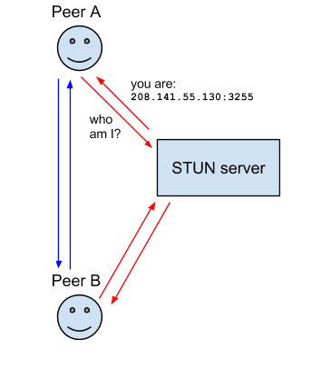
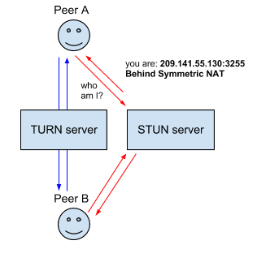

# WebRTC Protocols

Introduces the protocols on top of which the WebRTC API is built.

:::info

Resource: [Introduction to WebRTC protocols - MDN](https://developer.mozilla.org/en-US/docs/Web/API/WebRTC_API/Protocols)

:::

## ICE - Interactive Connectivity Establishment

A framework to allow your web browser to connect with peers.

There are many reasons why a straight up connection from Peer A to Peer B won't work. It needs to bypass firewalls that would prevent opening connections,give you a unique address if like most situations your device doesn't have a public IP address, and relay data through a server if your router doesn't allow you to directly connect with peers

ICE uses STUN and/or TURN servers to accomplish

## NAT - Network Address Translation

Is used to give your device a public IP address.

A router will have a public IP address and every device connected to the router will have a private IP address

Requests will be translated from the device's private IP to the router's public IP with a unique port. That way you don't need a unique public IP for each device but can still be discovered on the Internet.

Some routers will have restrictions on who can connect to devices on the network. This can mean that even though we have the public IP address found by the STUN server, not anyone can create a connection. In this situation we need to use TURN.

Some routers using NAT employ a restriction called **'Symmetric NAT'**. This means the router will only accept connections from peers you've previously connected to.

## STUN - Session Traversal Utilities for NAT

A protocol to discover your public address and determine any restrictions in your router that would prevent a direct connection with a peer.

The client will send a request to a STUN server on the Internet who will reply with the client's public address and whether or not the client is accessible behind the router's NAT.

## TURN - Session Traversal Utilities for NAT

Is meant to bypass the **Symmetric NAT** restriction by opening a connection with a TURN server and relaying all information through that server

You would create a connection with a TURN server and tell all peers to send packets to the server which will then be forwarded to you.

:::danger

This obviously comes with some overhead so it is only used if there are no other alternatives.

:::

## SDP - Session Description Protocol

A standard for describing the multimedia content of the connection such as resolution, formats, codecs, encryption, etc, so that both peers can understand each other once the data is transferring

:::caution

SDP is not truly a protocol, but a data format used to describe connection that shares media between devices

:::

SDP consists of one or more lines of UTF-8 text, each beginning with a one-character type, followed by an equals sign (`"="`), followed by structured text comprising a value or description, whose format depends on the type.
